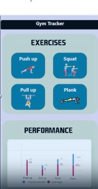

<!-- Improved compatibility of back to top link: See: https://github.com/othneildrew/Best-README-Template/pull/73 -->
<a id="readme-top"></a>
<!--
*** Thanks for checking out the Best-README-Template. If you have a suggestion
*** that would make this better, please fork the repo and create a pull request
*** or simply open an issue with the tag "enhancement".
*** Don't forget to give the project a star!
*** Thanks again! Now go create something AMAZING! :D
-->


<!-- PROJECT SHIELDS -->
<!--
*** I'm using markdown "reference style" links for readability.
*** Reference links are enclosed in brackets [ ] instead of parentheses ( ).
*** See the bottom of this document for the declaration of the reference variables
*** for contributors-url, forks-url, etc. This is an optional, concise syntax you may use.
*** https://www.markdownguide.org/basic-syntax/#reference-style-links
-->


<!-- PROJECT LOGO -->
<br />
<div align="center">
  <a href="https://github.com/ibrahimabdelaal/gym-monitoring">
    
  </a>

<h3 align="center">GYM MONITORING</h3>

  <p align="center">
     For workout Monitoring
    <!-- <br />
    <a href="https://github.com/github_username/repo_name"><strong>Explore the docs »</strong></a>
    <br />
    <br />
    <a href="https://github.com/github_username/repo_name">View Demo</a>
    ·
    <a href="https://github.com/github_username/repo_name/issues/new?labels=bug&template=bug-report---.md">Report Bug</a>
    ·
    <a href="https://github.com/github_username/repo_name/issues/new?labels=enhancement&template=feature-request---.md">Request Feature</a> -->
  </p>
</div>


<!-- TABLE OF CONTENTS -->


<!-- ABOUT THE PROJECT -->
## About The Project

[](https://example.com)


<!-- Here's a blank template to get started. To avoid retyping too much info, do a search and replace with your text editor for the following: `github_username`, `repo_name`, `twitter_handle`, `linkedin_username`, `email_client`, `email`, `project_title`, `project_description`, `project_license` -->

<p align="centre">(<a href="#readme-top">back to top</a>)</p>

[](https://example2.com)

<!-- ### Built With

* [![Next][Next.js]][Next-url]
* [![React][React.js]][React-url]
* [![Vue][Vue.js]][Vue-url]
* [![Angular][Angular.io]][Angular-url]
* [![Svelte][Svelte.dev]][Svelte-url]
* [![Laravel][Laravel.com]][Laravel-url]
* [![Bootstrap][Bootstrap.com]][Bootstrap-url]
* [![JQuery][JQuery.com]][JQuery-url] -->

<p align="right">(<a href="#readme-top">back to top</a>)</p>


<!-- GETTING STARTED -->
## Getting Started

setting up the project locally.

# AI Gym Workout Monitoring

## Description

This project provides a real-time workout monitoring system using pose estimation to track and analyze gym exercises such as pushups, pullups, deadlifts, and squats. The AI Gym system uses the YOLO Pose model to estimate body keypoints, calculates joint angles, and tracks repetitions during exercises.

## Prerequisites

Before starting, make sure you have the following installed:

* **Conda** for environment management
* **Python 3.8+**

To install the necessary dependencies and set up the environment, follow these steps:

### Installation


1. **Clone the Repository:**
2. **Create a Conda Environment:**
   First, create a new conda environment with Python 3.8:
   ```sh
   conda create --name gym-env python=3.8
   conda activate gym-env
3. **Install Dependencies:**
    ```sh
   pip install -r requirements.txt

3. **Run:**
    ```sh
   python run.py

