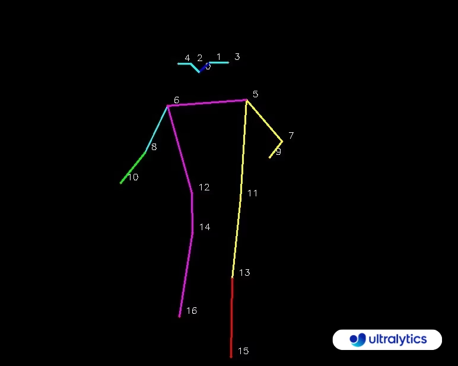

[](https://example2.com)

Here's a sample video of the pose detection in action:


<video src="https://github.com/user-attachments/assets/8232b50a-db83-4255-a4e1-9b2ba5017e28" controls></video>


<video src="Output/deadlift_out.mp4" controls></video>


## Side Project:  AI Gym Workout Monitoring


This project aims to develop a modular workout tracking system utilizing YOLO for pose estimation. The initial focus is on building a solid foundation. Future enhancements will include:

Real-time error detection: Providing instant feedback on exercise form with clear explanations for corrections.
Expanded exercise library: Enabling easy integration of new exercises through a user-friendly interface.
Improved accuracy: Continuously refining the pose detection model to ensure accurate tracking.

## Getting Started
setting up the project locally.

## Prerequisites

Before starting, make sure you have the following installed:

* **Conda** for environment management
* **Python 3.8+**

To install the necessary dependencies and set up the environment, follow these steps:

### Installation


1. **Clone the Repository:**
2. **Create a Conda Environment:**
   First, create a new conda environment with Python 3.8:
   ```sh
   conda create --name gym-env python=3.8
   conda activate gym-env
3. **Install Dependencies:**
    ```sh
   pip install -r requirements.txt

3. **Run:**
    ```sh
   python run.py

